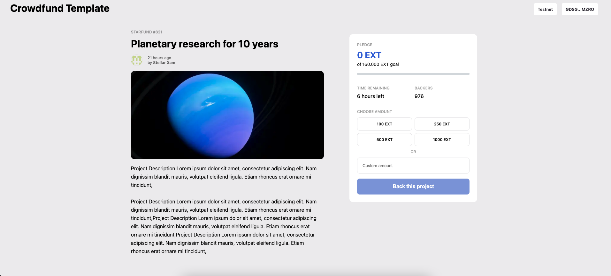

Soroban Crowdfunding Dapp Example
=================================

# Soroban Dapps Challenge

Follow along at the official Soroban Dapps Challenge! Check it out [here](https://soroban.stellar.org/dapps/dapp-challenges/challenge-0-crowdfund).

## Original README

This is an example of a Crowdfunding Dapp on Stellar adapted for the Soroban Dapps Challenge. You can visit the original project [here](https://github.com/stellar/soroban-example-dapp).



This is a [Next.js](https://nextjs.org/) project, demoing how to build a dapp frontend
backed by smart contracts on Stellar.

Getting Started
===============

Install Dependencies
--------------------
1. `rustc` >= 1.71.0 with the `wasm32-unknown-unknown` target installed. See https://soroban.stellar.org/docs/getting-started/setup#install-rust . If you have already a lower version, the easiest way to upgrade is to run `rustup update` or to uninstall (`rustup self uninstall`) and install it again.
2. `soroban-cli`. See https://soroban.stellar.org/docs/getting-started/setup#install-the-soroban-cli, but instead of `cargo install soroban-cli`, run `cargo install_soroban`. This is an alias set up in [.cargo/config.toml](./.cargo/config.toml), which pins the local soroban-cli to a specific version.
3. Node.js v18
4. [Freighter Wallet](https://www.freighter.app/) ≥[v5.15.0](https://github.com/stellar/freighter/releases/tag/5.15.0). Or from the Firefox / Chrome extension store. Once installed, enable "Experimental Mode" in the settings (gear icon).
5. If you want to skip installing specific `rustc` or `soroban-cli` versions, open a development environment on Gitpod:

   [](https://gitpod.io/#https://github.com/huuquyet/soroban-crowdfund)


6. **NOTE** - Follow the instructions below for Futurenet or Standalone and ensure that you have funded your wallet address that you intend to use from browser, otherwise the dapp display will be blank and a 'Account not found' will be printed on browser's console only.    

Run Backend
-----------

Make sure to start from a clean setup:
```
npm run clean
```

You have two options: 
1. Deploy on [Futurenet](https://soroban.stellar.org/docs/getting-started/deploy-to-testnet) using a remote RPC endpoint [(Admin guide)](https://developers.stellar.org/network/soroban-rpc/admin-guide), 
2. Run your own Futerenet RPC node with [Docker](https://soroban.stellar.org/dapps/guides/docker) and deploy to it

### Option 1: Deploy on Futurenet

0. Make sure you have soroban-cli installed, as explained above

1. Deploy the contracts and initialize them

       npm run setup

   This runs `./initialize.sh futurenet` behind the scenes, which will create a `token-admin` identity for you (`soroban config identity create token-admin`) and deploy a Fungible Token contract as well as the [crowdfund contract](./soroban/contracts/crowdfund), with this account as admin.

2. Select the Futurenet network in your Freighter browser extension

### Option 2: Localnet/Standalone on docker

0. If you didn't yet, build the `soroban-preview` docker image, as described above:

       make build-docker

1. In one terminal, run the backend docker containers and wait for them to start:

       ./quickstart.sh standalone

   You know that it fully started if it goes into a loop publishing & syncing checkpoints.

   You can stop this process with <kbd>ctrl</kbd><kbd>c</kbd>

2. Keep that running, then deploy the contracts and initialize them:

   You can use your own local soroban-cli:

       NETWORK=standalone npm run setup

   Or run it inside the soroban-preview docker container:

       docker exec soroban-preview ./initialize.sh standalone

   **Note:** this state will be lost if the quickstart docker container is removed, which will happen if you stop the `quickstart.sh` process. You will need to re-run `./initialize.sh` every time you restart the container.

3. Add the Standalone custom network in Freighter

   |   |   |
   |---|---|
   | Name | Standalone |
   | URL | http://localhost:8000/soroban/rpc |
   | Passphrase | Standalone Network ; February 2017 |
   | Allow HTTP connection | Enabled |
   | Switch to this network | Enabled |

4. Add some Standalone network lumens to your Freighter wallet.

   1. Copy the address for your freighter wallet.
   2. Visit `http://localhost:8000/friendbot?addr=<your address>`


Frontend
--------

Now that you're running the backend, you can run the development server:

    npm run dev

Open [http://localhost:3000](http://localhost:3000) with your browser to see the result.

**Note:** Before you can "Back this project", you'll need to have some EXT (example
token) in your freighter wallet. There is a "Mint 100 EXT" button, which will
gift you 100 EXT tokens for that purpose.

User Workflows
==============

The contract dev should be able to:

- Clone the example repo (this one)
- Choose their target amount and deadline
- Deploy their contract to futurenet
- Deploy a soroban rpc server somewhere (TBD)
- Deploy the example web ui somewhere (e.g. netlify)

Then via the web UI, users should be able to:

- Connect their wallet (freighter for now)
- See their current balance(s)
- See the current fundraising status (total amount & time remaining)
- See allowed assets (xlm-only for now?)
- Deposit an allowed asset
- See their deposit(s) appear on the page as the transactions are confirmed.
- "Live"-Update the page with the total amount with the new amount